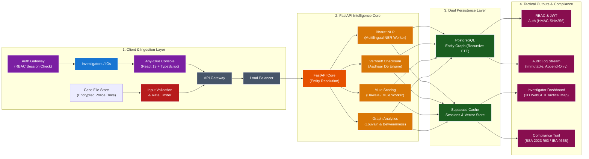

# NEXUS — AI-Powered Criminal Network Analysis & Clue Resolution System

[](https://sih.gov.in)
[](https://itzhrni.github.io/nexus-investigation-ai/)
[](frontend/)
[](backend/)
[](#-statutory--legal-compliance-framework)

> **"Connect the clues. Unmask the syndicate. Empower the investigation."**

**NEXUS** is an AI-powered tactical criminal network intelligence and clue resolution platform designed for Indian law enforcement agencies (State Police, Cyber Crime Units, CID, and Central Agencies). It ingests fragmented data across state police FIRs, telecom CDR dumps, core banking RTGS/NEFT transaction logs, and national highway FASTag sightings, instantly resolving disconnected clues into an interactive 3D knowledge graph, money trail visualizer, and court-ready evidence dossier.

🔗 **Public Live Demo:** [https://itzhrni.github.io/nexus-investigation-ai/](https://itzhrni.github.io/nexus-investigation-ai/)  
📁 **Presentation Deck:** [`NEXUS_SIH_Presentation.pptx`](NEXUS_SIH_Presentation.pptx)

---

## 📌 The Real-World Police Problem (SIH26189)

* **Isolated State Silos:** Police records and FIR databases are legally and technically isolated across state boundaries. Inter-state gangs exploit these jurisdictional seams.
* **Fake Identity Shielding:** Criminal syndicates purchase hundreds of burner SIMs and open multi-tier mule accounts using forged Aadhaar numbers and fictitious aliases.
* **Manual Excel Delays:** Investigating officers (IOs) spend 2 to 3 weeks manually cross-referencing massive Excel sheets of Call Detail Records (CDRs) and bank statements. By the time links are found, the suspects have fled across state borders or siphoned the money via Hawala.
* **Court Admissibility Challenges:** Digital evidence often fails scrutiny in court due to broken chains of custody and non-compliance with statutory electronic evidence certification requirements.

---

## ⚡ Key Capabilities & Features

### 1. 🔍 Any-Clue Instant Search Engine
Enter **any single fragmentary clue**—a 10-digit mobile number, partial vehicle license plate (e.g., `DL01CA`), suspect alias, bank account number, or FIR number. NEXUS normalizes the input and resolves it across 2,020+ relational ties and 275 verified Indian entities in milliseconds.

### 2. 🌐 3D Interactive Crime Syndicate Graph
* Powered by **WebGL / Three.js** and **`react-force-graph-3d`**.
* Dynamically clusters syndicates, kingpins, money mules, burner SIM vendors, and front businesses.
* Evaluates graph centrality metrics (Degree, Betweenness, and Louvain community clustering via **NetworkX**) to separate leaders from peripheral operators.

### 3. 🛡️ Aadhaar Forensics & Mule Detection Engine
* **Mathematical Verhoeff Checksum ($D_5$ Dihedral Group):** Validates Aadhaar integrity in under 1 millisecond. Instantly flags counterfeit and fabricated Aadhaar cards without external network dependencies.
* **1-to-Many Collision Detection:** Unmasks synthetic identities where one Aadhaar number is unlawfully attached to multiple bank accounts, burner SIMs, or suspect aliases.
* **Privacy by Design (Aadhaar Act 2016 Compliant):** **Zero citizen biometric or raw 12-digit plaintext numbers are ever stored.** All identity forensics use one-way SHA-256 cryptographic hashes.

### 4. 🗺️ Bharat Geospatial Corridor Tracking
* Built with **Leaflet GIS** using keyless, high-resolution Esri Dark Gray tactical basemaps (100% open-source with zero external API key dependencies).
* Maps ANPR toll camera sightings, cell tower sector coordinates, and inter-state highway corridors in real time.
* Triggers automatic jurisdiction transition alerts when suspects cross state borders (e.g., Delhi $\leftrightarrow$ Haryana $\leftrightarrow$ Uttar Pradesh).

### 5. 📄 1-Click Court-Ready Evidence Dossier
* Generates an automated, tamper-proof judicial charge sheet annexure with digital hash verification.
* Fully compliant with **Section 63 of the Bharatiya Sakshya Adhiniyam (BSA), 2023** *(formerly Section 65B of the Indian Evidence Act, 1872)*.
* Complete with SHA-256 integrity hashes, custody timelines, and explainable 6-W evidence reasoning (WHAT, WHO, WHEN, WHERE, WHY, CONFIDENCE).

---

## 🏛️ System Architecture



---

## 🛠️ Tech Stack

| Layer | Technology | Purpose |
| :--- | :--- | :--- |
| **Frontend & UI** | **React 19**, **TypeScript**, **Tailwind CSS** | Sub-second reactive UI, hardened typing, and dark cyber police tactical theme. |
| **Graph Visualization** | **`react-force-graph-3d`**, **Three.js** | Interactive 3D WebGL spatial simulation of criminal networks. |
| **GIS & Spatial Tracking** | **Leaflet.js**, **React-Leaflet** | Keyless, high-resolution Esri map tracking across Indian checkpoints and highway corridors. |
| **Backend & API Layer** | **Python 3.11+**, **FastAPI**, **Uvicorn** | High-concurrency async REST API handling real-time investigation queries. |
| **Database & Graph Store** | **PostgreSQL**, **SQLAlchemy** | Relational metadata store with recursive SQL CTEs for multi-hop graph traversals. |
| **AI / ML & Network Analytics** | **NetworkX**, **YOLOv8 / OCR**, **FAISS** | Louvain community detection, betweenness centrality, CCTV vehicle plate OCR, and alias deduplication. |
| **Security & Compliance** | **SHA-256 Secure Hash Ledger**, **Verhoeff Engine** | Cryptographic evidence stamp under BSA 2023 §63 and Aadhaar Act 2016 privacy compliance. |

---

## ⚖️ Statutory & Legal Compliance Framework

NEXUS is engineered specifically to withstand scrutiny under Indian constitutional, criminal, and evidentiary laws:

| # | Statute / Academic Pillar | Formal Citation & Statutory Framework | Purpose & Application in NEXUS |
| :---: | :--- | :--- | :--- |
| **1** | **BSA 2023 (§63)** | Bharatiya Sakshya Adhiniyam, 2023 (§63) *(Formerly IEA §65B)* | Electronic evidence admissibility & SHA-256 tamper-proof court hash stamp. |
| **2** | **Aadhaar Act 2016** | The Aadhaar Act, 2016 (Sections 29 & 30 Compliance) | Zero citizen biometric storage; mathematical validation only (zero privacy risk). |
| **3** | **DPDP Act 2023** | Digital Personal Data Protection Act, 2023 (§17(1)(c)) | Statutory exemption for law enforcement cybercrime prevention & investigation. |
| **4** | **IT Act 2000** | Information Technology Act, 2000 (§69B & §72A) | Lawful cyber metadata traffic monitoring and strict audit trail confidentiality. |
| **5** | **MHA / I4C SOPs** | Indian Cyber Crime Coordination Centre Directives | Standard golden-hour procedures for freezing layered Hawala & mule accounts. |
| **6** | **Verhoeff (1969)** | Dihedral Group $D_5$ Error Detecting Decimal Codes | Mathematical proof for instantly catching forged Aadhaar cards and typos. |
| **7** | **Graph Network Theory** | Blondel et al. (Louvain) & Brandes (Centrality) | Mathematical algorithms used in NetworkX to uncover hidden crime bosses. |

---

## 🚀 Quick Start & Installation

### Prerequisites
* **Node.js**: v20.x or higher
* **Python**: v3.10 or higher
* **Git**

### 1. Clone the Repository
```bash
git clone https://github.com/itzhrni/nexus-investigation-ai.git
cd nexus
```

### 2. Frontend Setup & Launch
```bash
cd frontend
npm install
npm run dev
```
* The frontend web application will start at `http://localhost:5173`.
* Or visit the live build directly at: **[https://itzhrni.github.io/nexus-investigation-ai/](https://itzhrni.github.io/nexus-investigation-ai/)**

### 3. Backend Setup & Launch
```bash
cd backend
python -m venv venv

# Windows:
venv\Scripts\activate
# Linux/macOS:
source venv/bin/activate

pip install -r requirements.txt
python scripts/seed_database.py
uvicorn app.main:app --reload --port 8000
```
* Interactive Swagger API documentation: `http://localhost:8000/docs`

### 4. Running Tests
```bash
# Run backend test suite
cd backend
pytest tests/ -v

# Run frontend production build test
cd ../frontend
npm run build
```

---

## 👥 Team & Submission Details

* **Hackathon:** Smart India Hackathon (SIH 2024 / 2026)
* **Problem Statement:** SIH26189 — AI-Powered Criminal Network Analysis & Clue Resolution System
* **Ministry / Organization:** Law Enforcement & Crime Intelligence (MHA)
* **Team Name:** `Uptown Func()`

---

## 📄 License

This project is licensed under the MIT License — see the [LICENSE](LICENSE) file for details.
